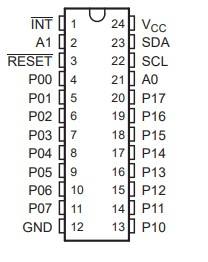

# PCA9539 16-Bit I/O Expander

PCA9539 GPIO expander library for Particle devices. It makes working with PCA9539 16-Bit I/O expander pins easier, with familiar functions like `pinMode()` and `digitalWrite()`. Refer to the [datasheet](http://www.ti.com/lit/ds/symlink/pca9539.pdf?ts=1590878066270) for more information about the chip.

## Documentation

### `PCA9539`
Creates a new PCA9539 class to manage a PCA9539 chip.

```Arduino
#include "PCA9539.h"
...
...
PCA9539 gpio;
...
...
void setup() {
  gpio.begin();
}
```

### `Pin mapping`



#### Parameters:
| #Pin | Port pin | Port name |
|------|----------|-----------|
| `0` | `4` | `P00` |
| `1` | `4` | `P01` |
| `2` | `4` | `P02` |
| `3` | `4` | `P03` |
| `4` | `4` | `P04` |
| `5` | `4` | `P05` |
| `6` | `4` | `P06` |
| `7` | `4` | `P07` |
| `8` | `4` | `P10` |
| `9` | `4` | `P11` |
| `10` | `4` | `P12` |
| `11` | `4` | `P13` |
| `12` | `4` | `P14` |
| `13` | `4` | `P15` |
| `14` | `4` | `P16` |
| `15` | `4` | `P17` |


### `begin([i2caddr])`
Initializes the device and performs initial I2C setup. This method should be called before any others are used.

#### Parameters:
| Name | Type | Description |
|------|------|-------------|
| `i2caddr` | `uint8_t` | Sets the slave address of the PCA9539, defaults to 0x20. |

```Arduino
void setup() {
  gpio.begin(0x20);
}
```

### `pinMode(pin, mode)`
Configures the specified pin to behave either as an input, inverted input, or output.

#### Parameters:
| Name | Type | Description |
|------|------|-------------|
| `pin` | `uint8_t` | Pin number whose mode you wish to set. |
| `mode` | `uint8_t` | Pin mode one of: `INPUT`, `INPUT_INVERTED`, or `OUTPUT`. |

```Arduino
void setup() {
  gpio.begin();
  gpio.pinMode(0, OUTPUT);
}
```

### `digitalWrite(pin, value)`
Writes a `HIGH` or a `LOW` value to a digital pin.

#### Parameters:
| Name | Type | Description |
|------|------|-------------|
| `pin` | `uint8_t` | Pin number whose value you wish to set. |
| `value` | `uint8_t` | Pin value one of: `HIGH`, or `LOW`. |

```Arduino
void loop() {
  gpio.digitalWrite(0, LOW);
  delay(500);
  gpio.digitalWrite(0, HIGH);
  delay(500);
}
```

### `digitalRead(pin)`
Reads the value from a specified digital pin, either `HIGH` or `LOW`.

*Note: when using `INPUT_INVERTED` on `pinMode()`, you will get the inverted status.*

#### Parameters:
| Name | Type | Description |
|------|------|-------------|
| `pin` | `uint8_t` | Pin number whose value you wish to get. |

#### Returns:
`uint8_t` - The status of the pin either HIGH or LOW.

```Arduino
void loop() {
  uint8_t buttonStatus = gpio.digitalRead(1);
  if (buttonStatus == HIGH) {
    gpio.digitalWrite(0, LOW); // LED On
  } else {
    gpio.digitalWrite(0, HIGH); // LED Off
  }
}
```

## LICENSE
Copyright 2020 Alfonso Martinez Alcantara

Licensed under the MIT license
